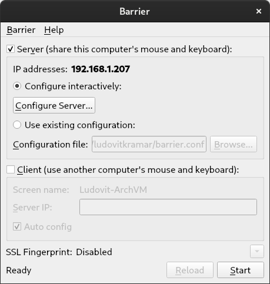
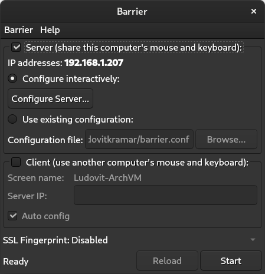

## Make QT software integrate visually with gnome adwaita

1. First step is to install `kvantum`.

2. Then open the application "Kvantum Manager" and under "Change/Delete Theme" select `KvGnome`, `KvGnomeDark` or `kvYaru` if on ubuntu.

3. The environment variable `QT_STYLE_OVERRIDE=kvantum` needs to be set in order for it to work, but we can check the theme out by running an application from the console, an example with Audacious: `QT_STYLE_OVERRIDE=kvantum audacious`.

4. Now that we see it working, we can go ahead and add `QT_STYLE_OVERRIDE=kvantum` to `/etc/environment`. This can be done by opening the file with any text editor or by appending a line to the file like this: `echo 'QT_STYLE_OVERRIDE=kvantum' >> /etc/environment`.

5. Qt applications should now start with the kvantum theme.

Some applications have their own theme or settings, musescore for example doesn't follow the system theme, in krita we can go to `Settings` > `Styles` and sellect `kvantum`. 

Written on 11-Feb-2022 by Ludovit Kramar
